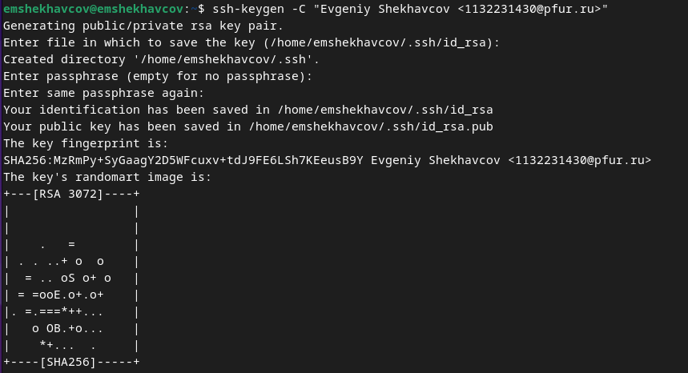
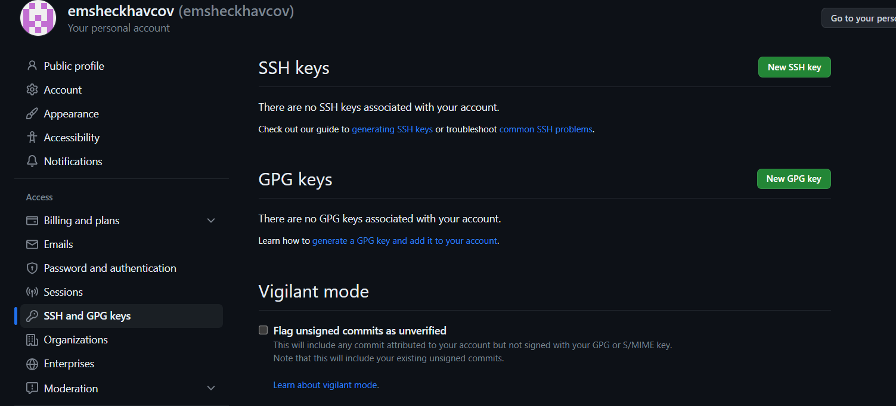
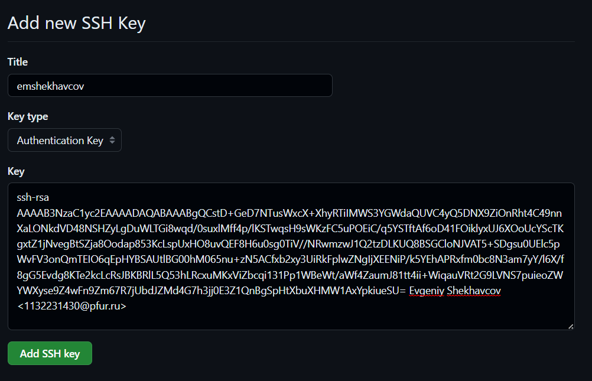
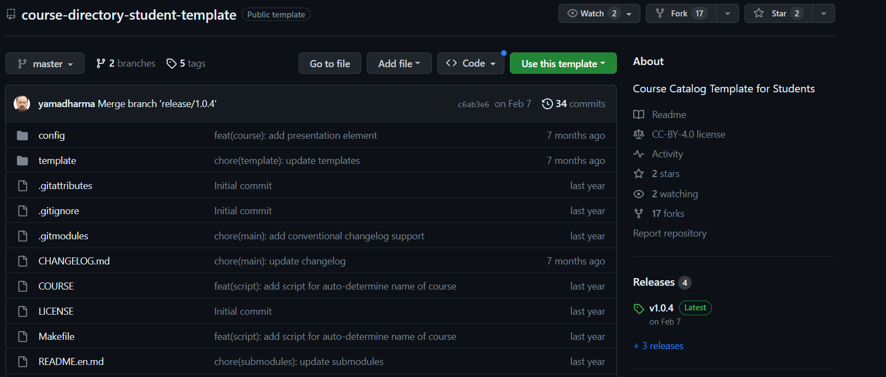
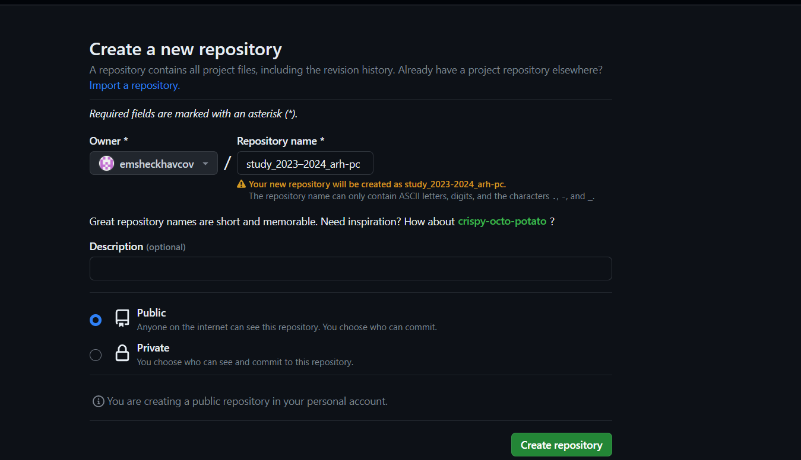
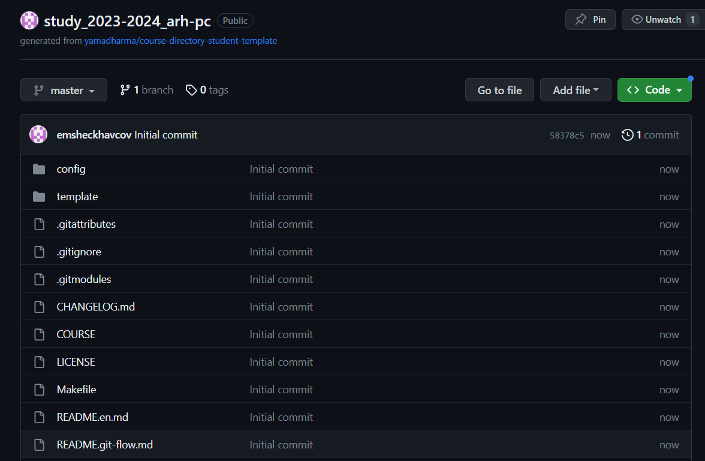
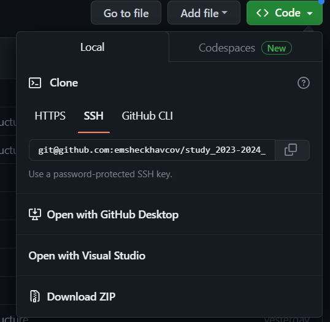
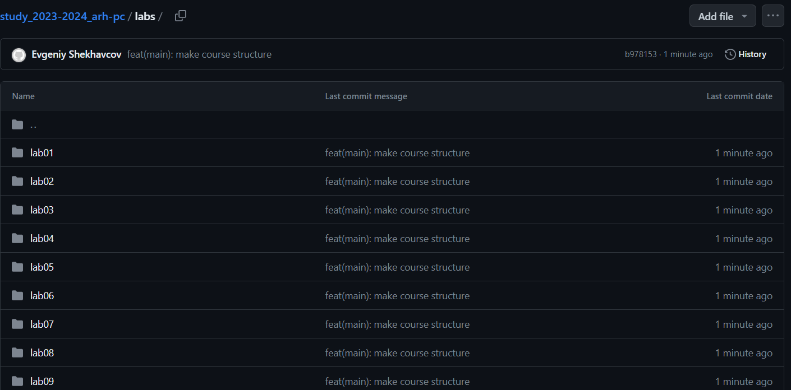

\usepackage[T2A]{fontenc}  \usepackage[cp1251]{inputenc}  \usepackage[russian]{babel}
# "Отчёт по лабораторной работе №2"
#### "Дисциплина: Архитектура компьютера"
#### "Шехавцов Евгений Михайлович"
### НКАбд-06-23
## Содержание
1 Цель работы 5
2 Задание 6
3 Теоретическое введение 7
4 Выполнение лабораторной работы 9
4.1 Настройка GitHub . . . . . . . . . . . . . . . . . . . . . . . . . . 9
4.2 Базовая настройка Git .............................................................................. 10
4.3 Создание SSH-ключа ..................................................................................... 11
4.4 Создание рабочего пространства и репозитория курса на основе
шаблона .................................................................................................... 14
4.5 Создание репозитория курса на основе шаблона .................................. 15
4.6 Настройка каталога курса ........................................................................ 17
5 Выводы 25
6 Список литературы 26
## Список иллюстраций
3
Список иллюстраций
4.1 Заполнение данных учетной записи GitHub . . . . . . . . . . . . 9
4.2 Аккаунт GitHub................................................................................................ 10
4.3 Предварительная конфигурация git ........................................................ 10
4.4 Настройка кодировки............................................................................... 11
4.5 Создание имени для начальной ветки.................................................... 11
4.6 Параметр autocrlf ..................................................................................... 11
4.7 Параметр safecrlf ...................................................................................... 11
4.8 Генерация SSH-ключа .................................................................................... 12
4.9 Установка утилиты xclip .......................................................................... 12
4.10 Копирование содержимого файла........................................................... 13
4.11 Окно SSH and GPG keys .................................................................................. 13
4.12 Добавление ключа .................................................................................... 14
4.13 Создание рабочего пространства ............................................................ 14
4.14 Страница шаблона для репозитория ...................................................... 15
4.15 Окно создания репозитория .................................................................... 16
4.16 Созданный репозиторий ......................................................................... 16
4.17 Перемещение между директориями ....................................................... 17
4.18 Клонирование репозитория .................................................................... 17
4.19 Окно с ссылкой для копирования репозитория ..................................... 17
4.20 Перемещение между директориями ....................................................... 18
4.21 Удаление файлов ...................................................................................... 18
4.22 Создание каталогов .................................................................................. 18
4.23 Добавление и сохранение изменений на сервере .................................. 19
4.24 Выгрузка изменений на сервер ............................................................... 19
4.25 Страница репозитория ............................................................................ 20
4.26 Создание файла ........................................................................................ 20
4.27 Меню приложений ................................................................................... 21
4.28 Работа с отчетом в текстовом процессоре .............................................. 21
4.29 Перемещение между директориями ....................................................... 22
4.30 Проверка местонахождения файлов ....................................................... 22
4.31 Копирование файла ................................................................................. 22
4.32 Перемещение между директориями ....................................................... 22
4.33 Копирование файла ................................................................................. 23
4.34 Добавление файла на сервер ................................................................... 23
4.35 Перемещение между директориями ....................................................... 23
4.36 Добавление файла на сервер ................................................................... 23
4.37 Подкаталоги и файлы в репозитории ..................................................... 24
4
4.38 Отправка в центральный репозиторий сохраненных изменений . 24
4.39 Страница каталога в репозитории ...........................................................24
4.40 Страница последних изменений в репозитории ....................................24
## 1 Цель работы
Целью данной работы является изучить идеологию и применение средств
контроля версий, а также приобрести практические навыки по работе с системой
git.
## 2 Задание
1. Настройка GitHub.
2. Базовая настройка Git.
3. Создание SSH-ключа.
4. Создание рабочего пространства и репозитория курса на основе шаблона.
5. Создание репозитория курса на основе шаблона.
6. Настройка каталога курса.
## 3 Теоретическое введение
Системы контроля версий (Version Control System, VCS) применяются при ра-
боте нескольких человек над одним проектом. Обычно основное дерево проекта
хранится в локальном или удалённом репозитории, к которому настроен до-
ступ для участников проекта. При внесении изменений в содержание проекта
система контроля версий позволяет их фиксировать, совмещать изменения, про-
изведённые разными участниками проекта, производить откат к любой более
ранней версии проекта, если это требуется. В классических системах контроля
версий используется централизованная модель, предполагающая наличие еди-
ного репозитория для хранения файлов. Выполнение большинства функций по
управлению версиями осуществляется специальным сервером. Участник про-
екта (пользователь) перед началом работы посредством определённых команд
получает нужную ему версию файлов. После внесения изменений пользователь
размещает новую версию в хранилище. При этом предыдущие версии не уда-
ляются из центрального хранилища и к ним можно вернуться в любой момент.
Сервер может сохранять не полную версию изменённых файлов, а производить
так называемую дельта-компрессию — сохранять только изменения между по-
следовательными версиями, что позволяет уменьшить объём хранимых данных.
Системы контроля версий поддерживают возможность отслеживания и разреше-
ния конфликтов, которые могут возникнуть при работе нескольких человек над
одним файлом. Можно объединить изменения, сделанные разными участниками,
вручную выбрать нужную версию, отменить изменения вовсе или заблокиро-
вать файлы для изменения. В зависимости от настроек блокировка не позволяет
8
другим пользователям получить рабочую копию или препятствует изменению
рабочей копии файла средствами файловой системы ОС, обеспечивая таким
образом привилегированный доступ только одному пользователю, работающему с
файлом. Системы контроля версий также могут обеспечивать дополнительные,
более гибкие функциональные возможности. Например, они могут поддерживать
работу с несколькими версиями одного файла, сохраняя общую историю измене-
ний до точки ветвления версий и собственные истории изменений каждой ветви.
Обычно доступна информация о том, кто из участников, когда и какие изменения
вносил. Обычно такого рода информация хранится в журнале изменений, доступ
к которому можно ограничить. В отличие от классических, в распределённых
системах контроля версий центральный репозиторий не является обязательным.
Среди классических VCS наиболее известны CVS, Subversion, а среди распреде-
лённых — Git, Bazaar, Mercurial. Принципы их работы схожи, отличаются они в
основном синтаксисом используемых в работе команд. Система контроля версий
Git представляет собой набор программ командной строки. Доступ к ним можно
получить из терминала посредством ввода команды git с различными опциями.
Благодаря тому, что Git является распределённой системой контроля версий,
резервную копию локального хранилища можно сделать простым копированием
или архивацией. Работа пользователя со своей веткой начинается с проверки
и получения изменений из центрального репозитория (при этом в локальное
дерево до начала этой процедуры не должно было вноситься изменений). Затем
можно вносить изменения в локальном дереве и/или ветке. После завершения
внесения какого-то изменения в файлы и/или каталоги проекта необходимо
разместить их в центральном репозитории.
# Выполнение лабораторной работы
## Настройка GitHub
Создаю учетную запись на сайте GitHub (рис. 4.1). Далее я заполнил основныеданные
учетной записи.
{fig:001
width=70%}
Аккаунт создан (рис.4.2).
{fig:002
width=70%}
## 4.2 Базовая настройка Git
Открываю виртуальную машину, затем открываю терминал и делаю пред-
варительную конфигурацию git. Ввожу команду git config –global user.name “”,
указывая свое имя и команду git config –global user.email “work@mail”, указывая
в ней электронную почту владельца, то есть мою (рис. 4.3).
{fig:003
width=70%}

Настраиваю utf-8 в выводе сообщений git для корректного отображения сим-
волов (рис. 4.4).
{fig:004
width=70%}
Задаю имя «master» для начальной ветки (рис. 4.5).
{fig:005
width=70%}

Задаю параметр autocrlf со значением input, так как я работаю в системе Linux,
чтобы конвертировать CRLF в LF только при коммитах (рис. 4.6). CR и LF – это сим-
волы, которые можно использовать для обозначения разрыва строки в текстовых
файлах.
{fig:006
width=70%}

Задаю параметр safecrlf со значением warn, так Git будет проверять преоб-
разование на обратимость (рис. 4.7). При значении warn Git только выведет
предупреждение, но будет принимать необратимые конвертации.
{fig:007
width=70%}
## 4.3 Создание SSH-ключа
ля последующей идентификации пользователя на сервере репозиториев необ-
ходимо сгенерировать пару ключей (приватный и открытый). Для этого ввожу
12
команду ssh-keygen -C “Имя Фамилия, work@email”, указывая имя владельца
и электронную почту владельца (рис. 4.8). Ключ автоматически сохранится в
каталоге ~/.ssh/.
{fig:008
width=70%}
Копирую открытый ключ из директории, в которой он был сохранен. (рис.
4.9).
{fig:009
width=70%}
Открываю браузер, захожу на сайт GitHub. Открываю свой профиль и выбираю
страницу «SSH and GPG keys». Нажимаю кнопку «New SSH key» (рис. 4.10).
{fig:0010
width=70%}
Вставляю скопированный ключ в поле «Key». В поле Title указываю имя для
ключа. Нажимаю «Add SSH-key», чтобы завершить добавление ключа (рис. 4.11).
{fig:0011
width=70%}
## 4.4 Создание рабочего пространства и репозитория курса на основе шаблона

Закрываю браузер, открываю терминал. Создаю директорию, рабочее про-
странство, с помощью утилиты mkdir, благодаря ключу -p создаю все директории
после домашней ~/work/study/2022-2023/“Архитектура компьютера” рекурсивно.
Далее проверяю с помощью ls, действительно ли были созданы необходимые
мне каталоги (рис. 4.12).
{fig:0012
width=70%}
## 4.5 Создание репозитория курса на основе шаблона

 браузере перехожу на страницу репозитория с шаблоном курса по адресу
https://github.com/yamadharma/course-directory-student-template. Далее выбираю
«Use this template», чтобы использовать этот шаблон для своего репозитория (рис.
4.13).
{fig:0013
width=70%}
В открывшемся окне задаю имя репозитория (Repository name): study_2023–2024_arh-
pc и создаю репозиторий, нажимаю на кнопку «Create repository from template»
(рис. 4.14).
{fig:0014
width=70%}
Репозиторий создан (рис. 4.15).
{fig:0015
width=70%}
Через терминал перехожу в созданный каталог курса с помощью утилиты cd
(рис. 4.16).
{fig:0016
width=70%}
Клонирую созданный репозиторий с помощью команды git clone –recursive
git@github.com:/study_2023–2024_arh-pc.git arch-pc (рис. 4.17).
{fig:0017
width=70%}
Копирую ссылку для клонирования на странице созданного репозитория, сна-
чала перейдя в окно «code», далее выбрав в окне вкладку «SSH» (рис. 4.18).
{fig:0018
width=70%}
## 4.6 Настройка каталога курса
Перехожу в каталог arch-pc с помощью утилиты cd (рис. 4.19).
{fig:0019
width=70%}
Удаляю лишние файлы с помощью утилиты rm (рис. 4.20).
{fig:0020
width=70%}
Создаю необходимые каталоги (рис. 4.21)
{fig:0021
width=70%}
Отправляю созданные каталоги с локального репозитория на сервер: добавляю
все созданные каталоги с помощью git add (не захватил в скриншот), комментирую
и сохраняю изменения на сервере как добавление курса с помощью git commit
(рис. 4.22).
{fig:0022
width=70%}
Отправляю все на сервер с помощью push (рис. 4.23)
{fig:0023
width=70%}
Проверяю правильность выполнения работы на сайте GitHub(рис. 4.24).
{fig:0024
width=70%}
## 5 Выводы
При выполнении данной лабораторной работы я изучил идеологию и при-
менение средств контроля версий, а также приобрел практические навыки по
работе с системой git.
## 6 Список литературы
1. Архитектура ЭВМ
2. Git - gitattributes Документация