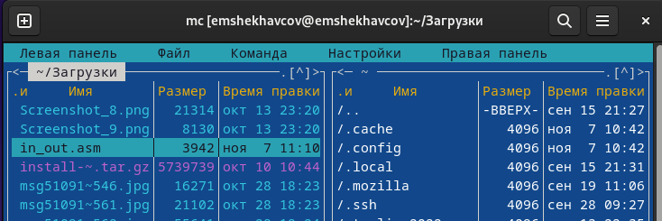

# Отчет по лабораторной работе №5
## Дисциплина: Архитектура компьютера
### Шехавцов Евгений Михайлович

### Содержание
1	Цель работы	1
2	Задание	1
3	Теоретическое введение	1
4	Выполнение лабораторной работы	2
4.1	Основы работы с mc	2
4.2	Структура программы на языке ассемблера NASM	4
4.3	Подключение внешнего файла	6
4.4	Выполнение заданий для самостоятельной работы	9
5	Выводы	12
6	Список литературы	12

## 1	Цель работы
Целью данной лабораторной работы является приобретение практических навыков работы в Midnight Commander, освоение инструкций языка ассемблера mov и int.
## 2	Задание
   1. Основы работы с mc
   2. Структура программы на языке ассемблера NASM
   3. Подключение внешнего файла
   4. Выполнение заданий для самостоятельной работы

## 3	Теоретическое введение

Midnight Commander (или просто mc) — это программа, которая позволяет просматривать структуру каталогов и выполнять основные операции по управлению файловой системой, т.е. mc является файловым менеджером. Midnight Commander позволяет сделать работу с файлами более удобной и наглядной. Программа на языке ассемблера NASM, как правило, состоит из трёх секций: секция кода программы (SECTION .text), секция инициированных (известных во время компиляции) данных (SECTION .data) и секция неинициализированных данных (тех, под которые во время компиляции только отводится память, а значение присваивается в ходе выполнения программы) (SECTION .bss). Для объявления инициированных данных в секции .data используются директивы DB, DW, DD, DQ и DT, которые резервируют память и указывают, какие значения должны храниться в этой памяти: - DB (define byte) — определяет переменную размером в 1 байт; - DW (define word) — определяет переменную размеров в 2 байта (слово); - DD (define double word) — определяет переменную размером в 4 байта (двойное слово); - DQ (define quad word) — определяет переменную размером в 8 байт (учетве- рённое слово); - DT (define ten bytes) — определяет переменную размером в 10 байт. Директивы используются для объявления простых переменных и для объявления массивов. Для определения строк принято использовать директиву DB в связи с особенностями хранения данных в оперативной памяти. Инструкция языка ассемблера mov предназначена для дублирования данных источника в приёмнике.
mov dst,src
Здесь операнд dst — приёмник, а src — источник. В качестве операнда могут выступать регистры (register), ячейки памяти (memory) и непосредственные значения (const). Инструкция языка ассемблера intпредназначена для вызова прерывания с указанным номером.
int n
Здесь n — номер прерывания, принадлежащий диапазону 0–255. При программировании в Linux с использованием вызовов ядра sys_calls n=80h (принято задавать в шестнадцатеричной системе счисления).

## 4	Выполнение лабораторной работы
### 4.1	Основы работы с mc

Открываю Midnight Commander, введя в терминал mc (рис. 1).

Перехожу в каталог ~/work/study/2023-2024/Архитектура Компьютера/arch-pc, используя файловый менеджер mc (рис. 2)

С помощью функциональной клавиши F7 создаю каталог lab05 (рис. 3).

Переходу в созданный каталог (рис. 4).

В строке ввода прописываю команду touch lab5-1.asm, чтобы создать файл, в котором буду работать (рис. 5).

### 4.2	Структура программы на языке ассемблера NASM
С помощью функциональной клавиши F4 открываю созданный файл для редактирования в редакторе nano (рис. 6).

Ввожу в файл код программы для запроса строки у пользователя (рис. 7). Далее выхожу из файла (Ctrl+X), сохраняя изменения (Y, Enter).

С помощью функциональной клавиши F3 открываю файл для просмотра, чтобы проверить, содержит ли файл текст программы (рис. 8).

Транслирую текст программы файла в объектный файл командой nasm -f elf lab5-1.asm. Создался объектный файл lab5-1.o. Выполняю компоновку объектного файла с помощью команды ld -m elf_i386 -o lab5-1 lab5-1.o (рис. 9). Создался исполняемый файл lab5-1.

Запускаю исполняемый файл. Программа выводит строку “Введите строку:” и ждет ввода с клавиатуры, я ввожу свои ФИО, на этом программа заканчивает свою работу (рис. 10).

### 4.3	Подключение внешнего файла
Скачиваю файл in_out.asm со страницы курса в ТУИС. Он сохранился в каталог “Загрузки” (рис. 11).

С помощью функциональной клавиши F5 копирую файл in_out.asm из каталога Загрузки в созданный каталог lab05 (рис. 12).

С помощью функциональной клавиши F5 копирую файл lab5-1 в тот же каталог, но с другим именем, для этого в появившемся окне mc прописываю имя для копии файла (рис. 13).

Изменяю содержимое файла lab5-2.asm во встроенном редакторе nano (рис. 14), чтобы в программе использовались подпрограммы из внешнего файла in_out.asm.

Транслирую текст программы файла в объектный файл командой nasm -f elf lab5-2.asm. Создался объектный файл lab5-2.o. Выполняю компоновку объектного файла с помощью команды ld -m elf_i386 -o lab5-2 lab5-2.o Создался исполняемый файл lab5-2. Запускаю исполняемый файл (рис. 15).

Открываю файл lab5-2.asm для редактирования в nano функциональной клавишей F4. Изменяю в нем подпрограмму sprintLF на sprint. Сохраняю изменения и открываю файл для просмотра, чтобы проверить сохранение действий (рис. 16).

Снова транслирую файл, выполняю компоновку созданного объектного файла, запускаю новый исполняемый файл (рис. 17).

Разница между первым исполняемым файлом lab5-2 и вторым lab5-2-2 в том, что запуск первого запрашивает ввод с новой строки, а программа, которая исполняется при запуске второго, запрашивает ввод без переноса на новую строку, потому что в этом заключается различие между подпрограммами sprintLF и sprint.
### 4.4	Выполнение заданий для самостоятельной работы
1.Создаю копию файла lab5-1.asm с именем lab5-1-1.asm с помощью функциональной клавиши F5 (рис. 18).

С помощью функциональной клавиши F4 открываю созданный файл для редактирования. Изменяю программу так, чтобы кроме вывода приглашения и запроса ввода, она выводила вводимую пользователем строку (рис. 19).

2.Создаю объектный файл lab5-1-1.o, отдаю его на обработку компоновщику, получаю исполняемый файл lab5-1-1, запускаю полученный исполняемый файл. Программа запрашивает ввод, ввожу свои ФИО, далее программа выводит введенные мною данные (рис. 20).

Код программы из пункта 1:

SECTION .data ; Секция инициированных данных
msg: DB 'Введите строку:',10
msgLen: EQU $-msg ; Длина переменной 'msg'
SECTION .bss ; Секция не инициированных данных
buf1: RESB 80 ; Буфер размером 80 байт
SECTION .text ; Код программы
GLOBAL _start ; Начало программы
_start: ; Точка входа в программу
mov eax,4 ; Системный вызов для записи (sys_write)
mov ebx,1 ; Описатель файла 1 - стандартный вывод
mov ecx,msg ; Адрес строки 'msg' в 'ecx'
mov edx,msgLen ; Размер строки 'msg' в 'edx'
int 80h ; Вызов ядра
mov eax, 3 ; Системный вызов для чтения (sys_read)
mov ebx, 0 ; Дескриптор файла 0 - стандартный ввод
mov ecx, buf1 ; Адрес буфера под вводимую строку
mov edx, 80 ; Длина вводимой строки
int 80h ; Вызов ядра
mov eax,4 ; Системный вызов для записи (sys_write)
mov ebx,1 ; Описатель файла '1' - стандартный вывод
mov ecx,buf1 ; Адрес строки buf1 в ecx
mov edx,buf1 ; Размер строки buf1
int 80h ; Вызов ядра
mov eax,1 ; Системный вызов для выхода (sys_exit)
mov ebx,0 ; Выход с кодом возврата 0 (без ошибок)
int 80h ; Вызов ядра

3.Создаю копию файла lab5-2.asm с именем lab5-2-1.asm с помощью функциональной клавиши F5 (рис. 21).

С помощью функциональной клавиши F4 открываю созданный файл для редактирования. Изменяю программу так, чтобы кроме вывода приглашения и запроса ввода, она выводила вводимую пользователем строку (рис. 22).

4.Создаю объектный файл lab5-2-1.o, отдаю его на обработку компоновщику, получаю исполняемый файл lab5-2-1, запускаю полученный исполняемый файл. Программа запрашивает ввод без переноса на новую строку, ввожу свои ФИО, далее программа выводит введенные мною данные (рис. 23).

Код программы из пункта 3:

%include 'in_out.asm'
SECTION .data ; Секция инициированных данных
msg: DB 'Введите строку: ',0h ; сообщение
SECTION .bss ; Секция не инициированных данных
buf1: RESB 80 ; Буфер размером 80 байт
SECTION .text ; Код программы
GLOBAL _start ; Начало программы
_start: ; Точка входа в программу
mov eax, msg ; запись адреса выводимого сообщения в `EAX`
call sprint ; вызов подпрограммы печати сообщения
mov ecx, buf1 ; запись адреса переменной в `EAX`
mov edx, 80 ; запись длины вводимого сообщения в `EBX`
call sread ; вызов подпрограммы ввода сообщения
mov eax,4 ; Системный вызов для записи (sys_write)
mov ebx,1 ; Описатель файла '1' - стандартный вывод
mov ecx,buf1 ; Адрес строки buf1 в ecx
int 80h ; Вызов ядра
call quit ; вызов подпрограммы завершения

## 5	Выводы
При выполнении данной лабораторной работы я приобрел практические навыки работы в Midnight Commander, а также освоил инструкции языка ассемблера mov и int.

## 6	Список литературы
1.Лабораторная работа №5
