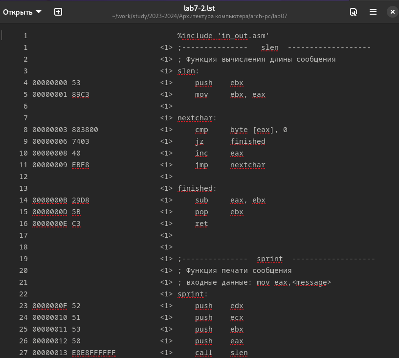

# Отчёт по лабораторной работе №7
## Дисциплина: архитектура компьютеров и операционные системы
### Шехавцов Евгений Михайлович
### Содержание
1	Цель работы	1
2	Задание	1
3	Теоретическое введение	1
4	Выполнение лабораторной работы	2
4.1	Реализация переходов в NASM	2
4.2	Изучение структуры файлы листинга	7
4.3	Задания для самостоятельной работы	9
5	Выводы	14
6	Список литературы	15
## 1	Цель работы
Изучение команд условного и безусловного переходов. Приобретение навыков написания программ с использованием переходов. Знакомство с назначением и структурой файла листинга.
## 2	Задание
   1. Реализация переходов в NASM.
   2. Изучение структуры файлы листинга.
   3. Задания для самостоятельной работы.
## 3	Теоретическое введение
Для реализации ветвлений в ассемблере используются так называемые команды передачи управления или команды перехода. Можно выделить 2 типа переходов:
• условный переход – выполнение или не выполнение перехода в определенную точку программы в зависимости от проверки условия.
• безусловный переход – выполнение передачи управления в определенную точку программы без каких-либо условий.
Безусловный переход выполняется инструкцией jmp. Инструкция cmp является одной из инструкций, которая позволяет сравнить операнды и выставляет флаги в зависимости от результата сравнения. Инструкция cmp является командой сравнения двух операндов и имеет такой же формат, как и команда вычитания.
Листинг (в рамках понятийного аппарата NASM) — это один из выходных файлов, создаваемых транслятором. Он имеет текстовый вид и нужен при отладке программы, так как кроме строк самой программы он содержит дополнительную информацию.
## 4	Выполнение лабораторной работы
### 4.1	Реализация переходов в NASM
Создаю каталог для программ лабораторной работы № 7, перехожу в него и создаю файл lab7-1.asm. (рис. 1).

Ввожу в файл lab7-1.asm текст программы из листинга 7.1. (рис. 2).

Создаю исполняемый файл и запускаю его. (рис. 3).

Таким образом, использование инструкции jmp _label2 меняет порядок исполнения инструкций и позволяет выполнить инструкции начиная с метки _label2, пропустив вывод первого сообщения.
Изменю программу таким образом, чтобы она выводила сначала ‘Сообщение № 2’, потом ‘Сообщение № 1’ и завершала работу. Для этого изменяю текст программы в соответствии с листингом 7.2. (рис.4).

Создаю исполняемый файл и проверяю его работу. (рис. 5).

Затем изменяю текст программы, добавив в начале программы jmp _label3, jmp _label2 в конце метки jmp _label3, jmp _label1 добавляю в конце метки jmp _label2, и добавляю jmp _end в конце метки jmp _label1, (рис. 6).

чтобы вывод программы был следующим: (рис. 7).

Рассмотрим программу, которая определяет и выводит на экран наибольшую из 3 целочисленных переменных: A,B и C. Значения для A и C задаются в программе, значение B вводиться с клавиатуры.
Создаю файл lab7-2.asm в каталоге ~/work/arch-pc/lab07. (рис. 8).

Текст программы из листинга 7.3 ввожу в lab7-2.asm. (рис. 9).

Создаю исполняемый файл и проверьте его работу. (рис. 10).

Файл работает корректно.
## 4.2	Изучение структуры файлы листинга
Создаю файл листинга для программы из файла lab7-2.asm. (рис. 11).

Открываю файл листинга lab7-2.lst с помощью текстового редактора и внимательно изучаю его формат и содержимое. (рис. 12).

В представленных трех строчках содержаться следующие данные: (рис. 13).

“2” - номер строки кода, “; Функция вычисления длинны сообщения” - комментарий к коду, не имеет адреса и машинного кода.
“3” - номер строки кода, “slen” - название функции, не имеет адреса и машинного кода.
“4” - номер строки кода, “00000000” - адрес строки, “53” - машинный код, “push ebx” - исходный текст программы, инструкция “push” помещает операнд “ebx” в стек.
Открываю файл с программой lab7-2.asm и в выбранной мной инструкции с двумя операндами удаляю выделенный операнд. (рис. 14).

Выполняю трансляцию с получением файла листинга. (рис. 15).

На выходе я не получаю ни одного файла из-за ошибки:инструкция mov (единственная в коде содержит два операнда) не может работать, имея только один операнд, из-за чего нарушается работа кода.
## 4.3	Задания для самостоятельной работы
1.Пишу программу нахождения наименьшей из 3 целочисленных переменных a, b и c. Значения переменных выбираю из табл. 7.5 в соответствии с вариантом, полученным при выполнении лабораторной работы № 6. Мой вариант под номером 11, поэтому мои значения 21 28 и 34. (рис. 16).

Создаю исполняемый файл и проверяю его работу, подставляя необходимые значение. (рис. 17).

Программа работает корректно.
Код программы:
2.%include 'in_out.asm'
section .data
   msg2 db "Наименьшее число: ",0h
   A dd 21
   B dd 28
   C dd 34
section .bss
   min resb 10
section .text
global _start
_start:
   mov ecx, [A] ; 'ecx = A'
   mov [min], ecx ; 'min = A'  ; вложили в переменную min значение А

                ; Сравниваем 'A' и 'C' (как числа)
   cmp ecx, [C]
   jl check_B ; если 'A < C', то переход на метку 'check_B',

   mov ecx, [C] ; иначе 'ecx = C'
   mov [min], ecx ; 'min = C'

check_B:
                ; Сравниваем 'min(A,C)' и 'B' (как числа)
   mov ecx, [min]
   cmp ecx, [B]
   jl fin ; если 'min(A,C) < B', то переход на 'fin',

   mov ecx, [B] ; иначе 'ecx = B'
   mov [min], ecx

fin:
   ; Вывод результата
   mov eax, msg2
   call sprint ; Вывод сообщения 'Наименьшее число: '

   mov eax, [min]
   call iprintLF ; Вывод 'min(A,B,C)'

   call quit ; Выход
3. Пишу программу, которая для введенных с клавиатуры значений х и а вычисляет значение и выводит результат вычислений заданной для моего варианта функции f(x):
х - 2, если х > 2
3*a, если х <= 2
(рис. 18).

Создаю исполняемый файл и проверяю его работу для значений х и а соответственно: (3;0), (1;2). (рис. 19).

Программа работает корректно.
Код программы:
%include 'in_out.asm'

SECTION .data
    msgX: db 'Введите x: ', 0h  ; 
    msgA: db 'Введите a: ', 0h  ; 
    result: db 'Результат: ', 0h

SECTION .bss
    x: resb 80   ; для ввода x
    a: resb 80   ; для ввода a
    res: resb 80 ; для результата вычислений

SECTION .text
    GLOBAL _start
    _start:
    
    mov eax, msgX
    call sprint 
    
        ; Ввод х 
    mov ecx, x
    mov edx, 80
    call sread
    mov eax, x
    call atoi
    mov [x], eax

    mov eax, msgA
    call sprint
    
        ; Ввод а
    mov ecx, a
    mov edx, 80
    call sread
    mov eax, a
    call atoi
    mov [a], eax

    ; Перемещение x в регистр ecx для дальнейших вычислений
    mov ecx, [x]

    ; сравнение x с 0
    cmp ecx, 0
    je _xisnull  ; "jump if equals" (x = 0) 
    jne _xisnotnull  ; "jump if not equals" (x != 0)

    _xisnull:
    ; вычисление f(x)= 4a, если x = 0
    mov eax, [a]   ; Загрузка значения a в регистр eax
    mov ebx, 4     ; Загрузка константы 4 в регистр ebx
    imul eax, ebx
    mov [res], eax
    jmp _fin  ; Переход к fin для завершения программы

    _xisnotnull:
    ; вычисление f(x)= 4a + x, если x != 0
    mov eax, [a]   ; Загрузка значения a в регистр eax
    mov ebx, 4     ; Загрузка константы 4 в регистр ebx
    imul eax, ebx  ; Умножение a на 4
    add eax, ecx   ; Прибавление x к результату
    mov [res], eax ; Сохранение результата в res
    jmp _fin

    _fin:
    mov eax, result
    call sprint
    mov eax, [res]
    call iprintLF
    call quit
## 5	Выводы
По итогам данной лабораторной работы я изучил команды условного и безусловного переходов, приобрел навыки написания программ с использованием переходов и ознакомился с назначением и структурой файла листинга, что поможет мне при выполнении последующих лабораторных работ.
## 6	Список литературы
    1. GDB: The GNU Project Debugger. — URL: https://www.gnu.org/software/gdb/.
    2. GNU Bash Manual. — 2016. — URL: https://www.gnu.org/software/bash/manual/.
    3. Midnight Commander Development Center. — 2021. — URL: https://midnight-commander. org/.
    4. NASM Assembly Language Tutorials. — 2021. — URL: https://asmtutor.com/.
    5. Newham C. Learning the bash Shell: Unix Shell Programming. — O’Reilly Media, 2005. — 354 с. — (In a Nutshell). — ISBN 0596009658. — URL: http://www.amazon.com/Learningbash-Shell-Programming-Nutshell/dp/0596009658.
    6. Robbins A. Bash Pocket Reference. — O’Reilly Media, 2016. — 156 с. — ISBN 978-1491941591.
    7. The NASM documentation. — 2021. — URL: https://www.nasm.us/docs.php.
    8. Zarrelli G. Mastering Bash. — Packt Publishing, 2017. — 502 с. — ISBN 9781784396879.
    9. Колдаев В. Д., Лупин С. А. Архитектура ЭВМ. — М. : Форум, 2018.
    10. Куляс О. Л., Никитин К. А. Курс программирования на ASSEMBLER. — М. : Солон-Пресс, 2017.
    11. Новожилов О. П. Архитектура ЭВМ и систем. — М. : Юрайт, 2016.
    12. Расширенный ассемблер: NASM. — 2021. — URL: https://www.opennet.ru/docs/RUS/nasm/.
    13. Робачевский А., Немнюгин С., Стесик О. Операционная система UNIX. — 2-е изд. — БХВПетербург, 2010. — 656 с. — ISBN 978-5-94157-538-1.
    14. Столяров А. Программирование на языке ассемблера NASM для ОС Unix. — 2-е изд. — М. : МАКС Пресс, 2011. — URL: http://www.stolyarov.info/books/asm_unix.
    15. Таненбаум Э. Архитектура компьютера. — 6-е изд. — СПб. : Питер, 2013. — 874 с. — (Классика Computer Science).
    16. Таненбаум Э., Бос Х. Современные операционные системы. — 4-е изд. — СПб. : Питер,2015. — 1120 с. — (Классика Computer Science).