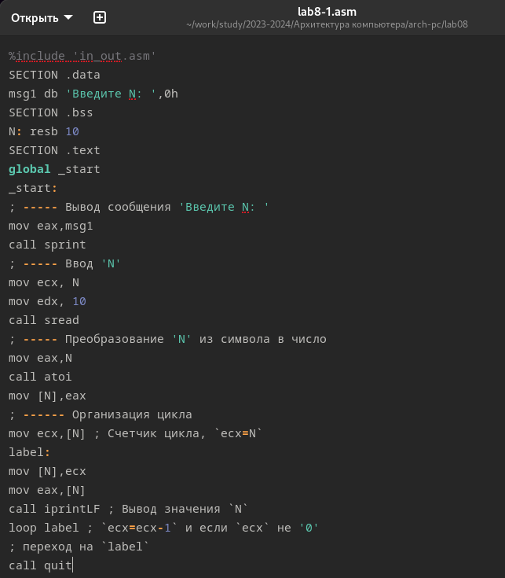
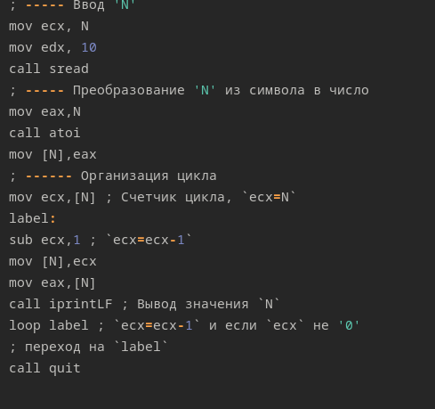
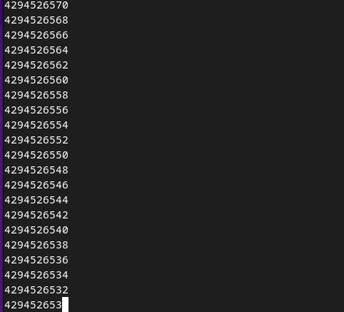
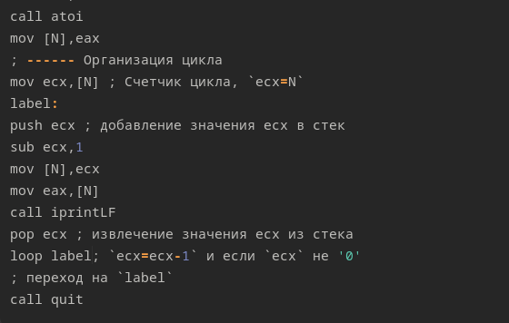
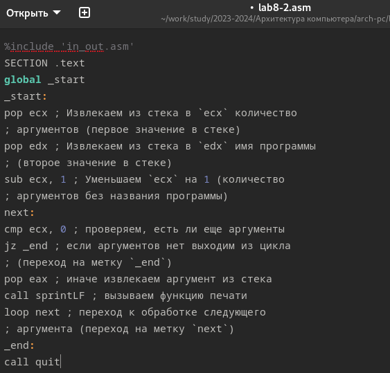
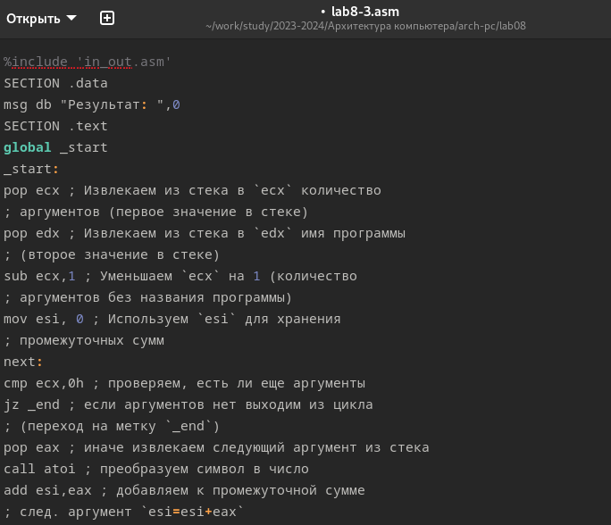
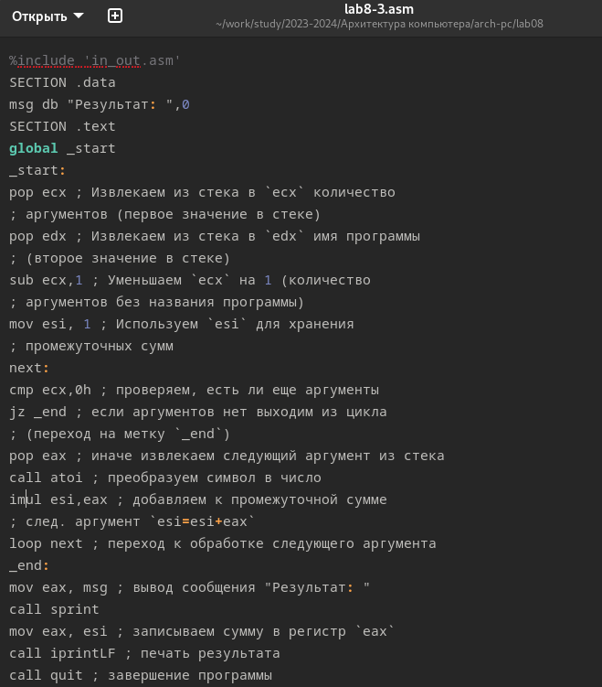
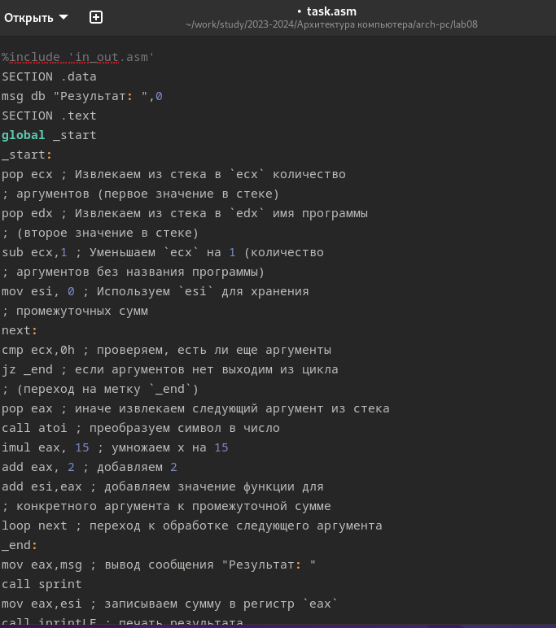

# Отчёт по лабораторной работе №8
## Дисциплина: архитектура компьютеров и операционные системы
### Шехавцов Евгений Михайлович
### Содержание
1	Цель работы	1
2	Задание	1
3	Теоретическое введение	1
4	Выполнение лабораторной работы	2
4.1	Реализация циклов в NASM	2
4.2	Обработка аргументов командной строки	5
4.3	Задание для самостоятельной работы	8
5	Выводы	10
6	Список литературы	10

## 1	Цель работы
Приобретение навыков написания программ с использованием циклов и обработкой аргументов командной строки.
## 2	Задание
   1. Реализация циклов в NASM.
   2. Обработка аргументов командной строки.
   3. Задание для самостоятельной работы.
## 3	Теоретическое введение
Стек — это структура данных, организованная по принципу LIFO («Last In — First Out» или «последним пришёл — первым ушёл»). Стек является частью архитектуры процессора и реализован на аппаратном уровне. Для работы со стеком в процессоре есть специальные регистры (ss, bp, sp) и команды. Основной функцией стека является функция сохранения адресов возврата и передачи аргументов при вызове процедур. Кроме того, в нём выделяется память для локальных переменных и могут временно храниться значения регистров. Стек имеет вершину, адрес последнего добавленного элемента, который хранится в регистре esp (указатель стека). Противоположный конец стека называется дном. Значение, помещённое в стек последним, извлекается первым. При помещении значения в стек указатель стека уменьшается, а при извлечении — увеличивается.
Команда push размещает значение в стеке, т.е. помещает значение в ячейку памяти, на которую указывает регистр esp, после этого значение регистра esp увеличивается на 4. Данная команда имеет один операнд — значение, которое необходимо поместить в стек.
Команда pop извлекает значение из стека, т.е. извлекает значение из ячейки памяти, на которую указывает регистр esp, после этого уменьшает значение регистра esp на 4. У этой команды также один операнд, который может быть регистром или переменной в памяти. Нужно помнить, что извлечённый из стека элемент не стирается из памяти и остаётся как “мусор”, который будет перезаписан при записи нового значения в стек.
Для организации циклов существуют специальные инструкции. Для всех инструкций максимальное количество проходов задаётся в регистре ecx. Наиболее простой является инструкция loop. Она позволяет организовать безусловный цикл.
## 4	Выполнение лабораторной работы
### 4.1	Реализация циклов в NASM
Создаю каталог для программ лабораторной работы № 8, перехожу в него и создаю файл lab8-1.asm. (рис.1).

Ввожу в файл lab8-1.asm текст программы из листинга 8.1. (рис.2).

Создаю исполняемый файл и проверяю его работу. (рис.3).

Данная программа выводит числа от N до 1 включительно.
Изменяю текст программы, добавив изменение значения регистра ecx в цикле. (рис.4).

Создаю исполняемый файл и проверяю его работу. (рис.5).

В данном случае число проходов цикла не соответствует введенному с клавиатуры значению.
Вношу изменения в текст программы, добавив команды push и pop для сохранения значения счетчика цикла loop. (рис.6).

Создаю исполняемый файл и проверяю его работу.(рис.7).

В данном случае число проходов цикла соответствует введенному с клавиатуры значению и выводит числа от N-1 до 0 включительно.
### 4.2	Обработка аргументов командной строки
Создаю файл lab8-2.asm в каталоге ~/work/arch-pc/lab08 и ввожу в него текст программы из листинга 8.2. (рис.8).

Создаю исполняемый файл и запускаю его, указав нужные аргументы. (рис.9).

Программа вывела 4 аргумента, так как аргумент 2 не взят в кавычки, в отличии от аргумента 3, поэтому из-за пробела программа считывает “2” как отдельный аргумент.
Рассмотрим пример программы, которая выводит сумму чисел, которые передаются в программу как аргументы. Создаю файл lab8-3.asm в каталоге ~/work/archpc/lab08 и ввожу в него текст программы из листинга 8.3. (рис.10).

Создаю исполняемый файл и запускаю его, указав аргументы. (рис.11).

Изменяю текст программы из листинга 8.3 для вычисления произведения аргументов командной строки. (рис.12).

Создаю исполняемый файл и запускаю его, указав аргументы. (рис.13).

### 4.3	Задание для самостоятельной работы
Написал программу, которая находит сумму значений функции f(x) = 15x + 2 (Вариант 11) для x = x1, x2, …, xn. Создал исполняемый файл и проверил его работу на нескольких наборах x = x1, x2, …, xn.(рис.14).

Создаю исполняемый файл и проверяю его работу на нескольких наборах x = x1, x2, …, xn. (рис.15).

Программа работает корректно.
Код программы:
%include 'in_out.asm'
SECTION .data
   msg db "Результат: ",0
SECTION .text
   global _start
_start:
   pop ecx    ; Извлекаем из стека в `ecx` количество
              ; аргументов (первое значение в стеке)
   pop edx    ; Извлекаем из стека в `edx` имя программы
              ; (второе значение в стеке)
   sub ecx,1  ; Уменьшаем `ecx` на 1 (количество
              ; аргументов без названия программы)
   mov esi, 0 ; Используем `esi` для хранения
              ; промежуточных сумм
next:
   cmp ecx,0h ; проверяем, есть ли еще аргументы
   jz _end    ; если аргументов нет выходим из цикла
              ; (переход на метку `_end`)
   pop eax    ; иначе извлекаем следующий аргумент из стека
   call atoi  ; преобразуем символ в число
   
   imul eax, 15    ; умножаем x на 15
   add eax, 2      ; добавляем 2 
   add esi,eax     ; добавляем значение функции для 
                   ; конкретного аргумента к промежуточной сумме
   loop next       ; переход к обработке следующего аргумента
_end:
   mov eax,msg    ; вывод сообщения "Результат: "
   call sprint
   mov eax,esi    ; записываем сумму в регистр `eax`
   call iprintLF  ; печать результата
   call quit      ; завершение программы
## 5	Выводы
Благодаря данной лабораторной работе я приобрел навыки написания программ использованием циклов и обработкой аргументов командной строки, что поможет мне при выполнении последующих лабораторных работ.
## 6	Список литературы
    1. GDB: The GNU Project Debugger. — URL: https://www.gnu.org/software/gdb/.
    2. GNU Bash Manual. — 2016. — URL: https://www.gnu.org/software/bash/manual/.
    3. Midnight Commander Development Center. — 2021. — URL: https://midnight-commander. org/.
    4. NASM Assembly Language Tutorials. — 2021. — URL: https://asmtutor.com/.
    5. Newham C. Learning the bash Shell: Unix Shell Programming. — O’Reilly Media, 2005 — 354 с. — (In a Nutshell). — ISBN 0596009658. — URL: http://www.amazon.com/Learningbash-Shell-Programming-Nutshell/dp/0596009658.
    6. Robbins A. Bash Pocket Reference. — O’Reilly Media, 2016. — 156 с. — ISBN 978-1491941591.
    7. The NASM documentation. — 2021. — URL: https://www.nasm.us/docs.php.
    8. Zarrelli G. Mastering Bash. — Packt Publishing, 2017. — 502 с. — ISBN 9781784396879.
    9. Колдаев В. Д., Лупин С. А. Архитектура ЭВМ. — М. : Форум, 2018.
    10. Куляс О. Л., Никитин К. А. Курс программирования на ASSEMBLER. — М. : Солон-Пресс, 2017.
    11. Новожилов О. П. Архитектура ЭВМ и систем. — М. : Юрайт, 2016.
    12. Расширенный ассемблер: NASM. — 2021. — URL: https://www.opennet.ru/docs/RUS/nasm/.
    13. Робачевский А., Немнюгин С., Стесик О. Операционная система UNIX. — 2-е изд. — БХВПетербург, 2010. — 656 с. — ISBN 978-5-94157-538-1.
    14. Столяров А. Программирование на языке ассемблера NASM для ОС Unix. — 2-е изд. — М. : МАКС Пресс, 2011. — URL: http://www.stolyarov.info/books/asm_unix.
    15. Таненбаум Э. Архитектура компьютера. — 6-е изд. — СПб. : Питер, 2013. — 874 с. — (Классика Computer Science).
    16. Таненбаум Э., Бос Х. Современные операционные системы. — 4-е изд. — СПб. : Питер,2015. — 1120 с. — (Классика Computer Science).